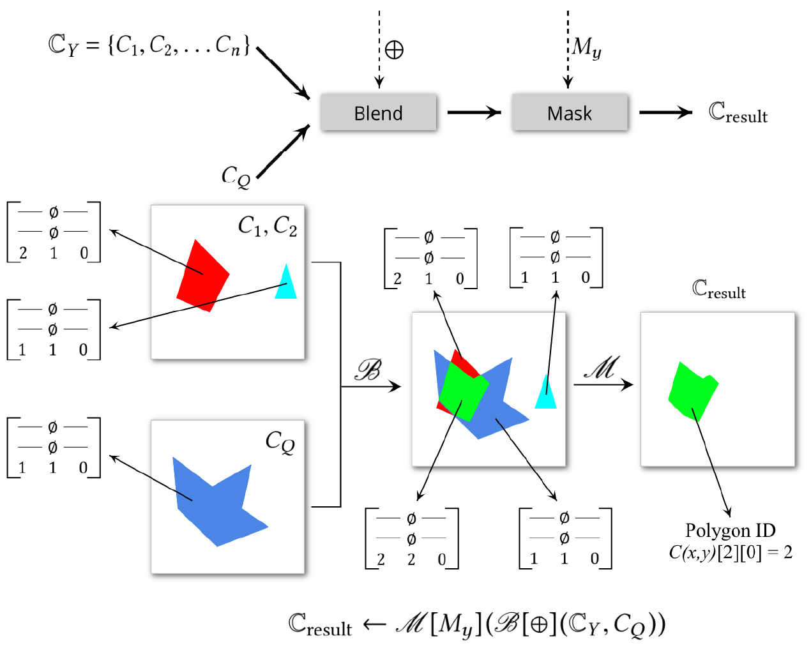

## 进度

多边形选多边形（blend polygons）

支持初始化、写入、直读 Canvas

输入点、凸多边形，并显示它们

## 额外依赖项

1. ~~Boost: GIL 用于读写 PNG 格式图片~~（已弃用）
2. Eigen: 用于高性能线性代数计算

## 疑难

### 几何变换的实现

注意到[几何变换](#几何变换)的目的坐标是通过 $\gamma$ 函数计算出来的。除非 $\gamma$ 函数拥有反函数，否则我们无法提前预知 $C'(x, y)$ 的数据来源。又由于可以*根据值变换*，$\gamma$ 函数几乎不可能拥有反函数。

所以，对于坐标 $(x, y)$，我们需要具有*写入任意坐标* $C'(x', y')$ 的能力，这与传统 OpenGL 的渲染管线的理念相悖。传统 OpenGL 约定，每个像素（准确地说是片元）运行着一个片元着色器（fragment shader），无论如何，数据一定被写入当前的像素中，而不能写入其他像素，故不具备“*写入任意坐标*”的能力。

好在现代 OpenGL 为了 GPGPU 添加了新的工具：[Image](https://www.khronos.org/opengl/wiki/Image_Load_Store)。Image 就像 CUDA 中位于全局内存的数组，可以任意地读取和写入，但是操作顺序、同步、原子性等问题须由程序员负责。

目前暂定所有数据存储都使用 Image 来抽象。暂不知传统 Texture 和 Image 的性能差异（官方 Wiki 并无说明）。

注：涉及[几何变换](#几何变换)的运算还有[映射](#映射)、[聚合](#聚合-aggregate-查询)。

### 切分 (Dissect) 的实现

原文称[切分](#切分-dissect)是针对每个非空像素点，单独挑出，形成 Canvas。我认为纯粹依照原文的概念，极难实现这一操作。首先，原文声称用 OpenGL Texture 来实现 Canvas，然而 OpenGL 支持的最大 Texture 数量十分有限（在我的机器上最多 80 个），难道切分操作不支持超过 80 个非空像素点吗？其次，一张 Canvas 的空间消耗极大。假设原文中 $S$ 的每个元素为 4 字节，则一个像素 $S^3$ 至少需要 36 字节（原文已指明还需额外的标记位，故空间消耗应更多）。假设 Canvas 的分辨率为 1024x1024，那么一张 Canvas 的空间消耗至少为 36 MB。80张这样的 Canvas 就需要 2880 MB 显存，若每张 Canvas 只有一个非空像素点，太过奢侈。第三，据我所知，OpenGL 的输出空间是不能在着色器运行时修改的，问题是我怎么知道切分操作会生成多少张 Canvas 呢，除非我两次遍历？

综上所述，[切分](#切分-dissect)的实现不可能是朴素的，不能照搬论文中的概念进行操作。

我目前的想法是，将[切分](#切分-dissect)定义为一种特殊的中间运算，定义特殊的储存格式与其运算结果对应，而不是 Canvas。副作用是，这会产生切分与后续运算的耦合性。

---

以下内容（除实现外）皆来自 arXiv:2004.03630 [cs]

## 运算符

### 基本运算符

#### 几何变换

$$
C'=\mathscr{G}[\gamma](C)
$$

1. 根据坐标变换：$C'(\gamma(x, y))=C(x, y)$
2. 根据值变换：$C'(\gamma(C(x, y)))=C(x, y)$

#### 值变换

$$
C'=\mathscr{V}[f](C)
\\
f: \mathbb{R}^{2} \times S^{3} \rightarrow S^{3}
$$

根据值和坐标变换：$C'(x, y)=f(x, y, C(x, y))$

#### 遮罩

$$
C'=\mathscr{M}[M](C)
$$

若值不符合要求，则抛弃之：

$C'(x, y)=\left\{\begin{array}{ll}C(x, y), & \text { if } C(x, y) \in M \\ \emptyset & \text { otherwise }\end{array}\right.$

#### 混合

$$
C'=\mathscr{B}[\odot]\left(C_{1}, C_{2}\right)\\
\odot: S^{3} \times S^{3} \rightarrow S^{3}
$$

根据两旧值产生新值：

 $C'(x, y)= C_{1}(x, y) \odot C_{2}(x, y)$

#### 切分 (Dissect)

$$
\left\{C_{1}, C_{2}, \ldots, C_{n}\right\}=\mathscr{D}(C)
$$

每个非空像素点产生一张新 canvas：

$C_{i}\left(x', y'\right)=\left\{\begin{array}{ll}C(x, y), & \text { if }\left(x', y'\right)=(x, y) \\ \emptyset & \text { otherwise }\end{array}\right.$

### 派生运算符

#### 多重混合

$$
\begin{aligned}
C' = & \mathscr{B}^{*}[\odot]\left(C_{1}, C_{2}, \ldots, C_{n}\right)\\
  = & \mathscr{B}[\odot]\left(C_{1}, \mathscr{B}[\odot]\left(C_{2}, \mathscr{B}[\odot]\left(C_{3}, \ldots\right)\right)\right)
\end{aligned}
$$

#### 映射

$$
\begin{aligned}
\left\{C_{1}, C_{2}, \ldots, C_{n}\right\}=&\mathscr{D}^{*}[\gamma](C)\\
=& \mathscr{G}[\gamma](\mathscr{D}(C))

\end{aligned}
$$

## 表达

### 选择查询

#### 选点 

$C_{i}(x, y)[0]=\left\{\begin{array}{ll}(i d, 1,0) & \text { if }(x, y)=\left(x_{i}, y_{i}\right) \\ \emptyset & \text { otherwise }\end{array}\right.$

$C_{i}(x, y)[1]=C_{i}(x, y)[2]=\emptyset$

$\begin{aligned} C_{Q}(x, y)[0] &=C_{Q}(x, y)[1]=\emptyset \\ C_{Q}(x, y)[2] &=\left\{\begin{array}{ll}(1,1,0) & \text { if }(x, y) \text { falls inside } Q \\ \emptyset & \text { otherwise }\end{array}\right.\end{aligned}$

$\mathbb{C}_{\text {result }} \leftarrow \mathscr{M}\left[M_{p}\right]\left(\mathscr{B}[\odot]\left(\mathbb{C}_{P}, C_{Q}\right)\right)$

$s_{1} \odot s_{2}=\left[\begin{array}{ccc}s_{1}[0][0] & s_{1}[0][1] & s_{1}[0][2] \\ - & \emptyset & - \\ s_{2}[2][0] & s_{2}[2][1] & s_{2}[2][2]\end{array}\right]$

$M_{p}=\left\{s \in S^{3} \mid s[0] \neq \emptyset\right.$ and $\left.s[2][0]=1\right\}$

#### 选多边形

$\begin{aligned} C_{i}(x, y)[0] &=C_{i}(x, y)[1]=\emptyset \\ C_{i}(x, y)[2] &=\left\{\begin{array}{ll}(i d, 1,0) & \text { if }(x, y) \text { falls inside } Y_{i} \\ \emptyset & \text { otherwise }\end{array}\right.\end{aligned}$

$\mathbb{C}_{\text {result }} \leftarrow \mathscr{M}\left[M_{y}\right]\left(\mathscr{B}[\oplus]\left(\mathbb{C}_{Y}, C_{Q}\right)\right)$

$s_{1} \oplus s_{2}=\left[\begin{array}{ccc}- & \emptyset & - \\ - & \emptyset & - \\ s_{1}[2][0] & s_{1}[2][1]+s_{2}[2][1] & s_{1}[2][2]\end{array}\right]$

$M_{y}=\left\{s \in S^{3} \mid s[2][1]=2\right\}$

### 连接 (Join) 查询

[TODO]

### 聚合 (Aggregate) 查询

SELECT COUNT (*) FROM $D_P$ WHERE Location INSIDE $Q$

 $C_{\text {count }} \leftarrow \mathscr{B}^{*}[+]\left(\mathscr{G}\left[\gamma_{c}\right]\left(\mathbb{C}_{\text {result }}\right)\right)$

 $\gamma_{c}: S^{3} \rightarrow \mathbb{R}^{2}: \gamma_{c}(s)=(s[2][0], 0), \forall s \in S^{3} ;$ 

$+: S^{3} \times S^{3} \rightarrow S^{3}$ : 
$$
s_{1}+s_{2}=\left[\begin{array}{ccc}
0 & s_{1}[0][1]+s_{2}[0][1] & 0 \\
- & \emptyset & - \\
s_{2}[2][0] & s_{2}[2][1] & s_{2}[2][2]
\end{array}\right]
$$
$\mathbb{C}_{\text {result }} \leftarrow \mathscr{M}\left[M_{p}\right]\left(\mathscr{B}[\odot]\left(\mathbb{C}_{P}, C_{Q}\right)\right)$ 是选点查询的结果。是多张 canvas。

### 第k近邻居查询

做法：给定一个半径画圆，求出点的数量，据此二分答案。

## 实现注意点

1. 对于点，需要记住精确的 location
2. 对于多边形，需要标记像素是否在边界上
3. 使用扩展：conservative rasterization
4. 维护一个map，将位于边界的像素映射到原多边形（矢量形式）
5. 用 (r,g,b,a) 来储存 canvas function
6. 对于有洞的多边形，先绘制无洞版本，再单独绘制洞，做减法
7. *混合* 通过直接 alpha blending 两张 textures 实现
8. *遮罩* 并行地测试每个像素点。此时边界信息用于精确测试每个像素是否位于多边形边界。

